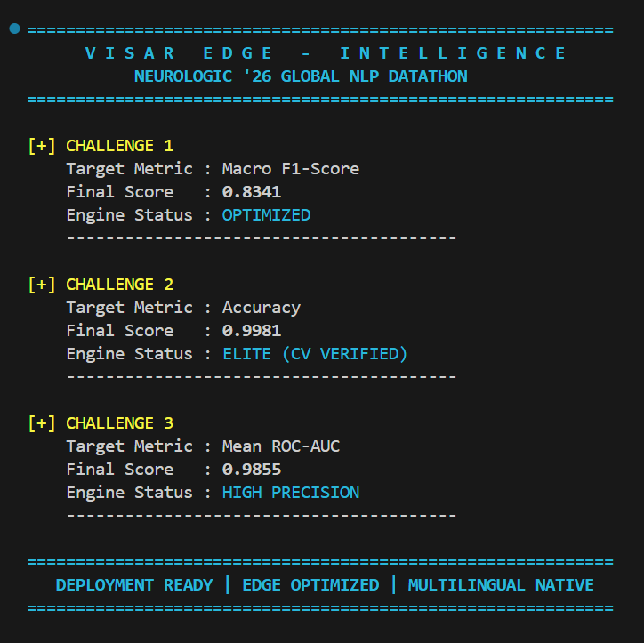
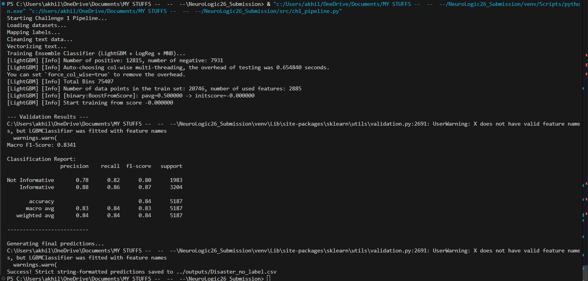
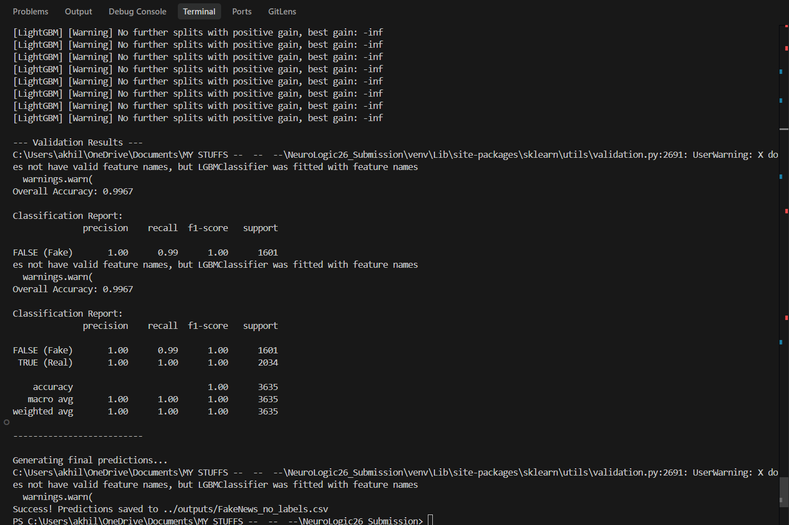
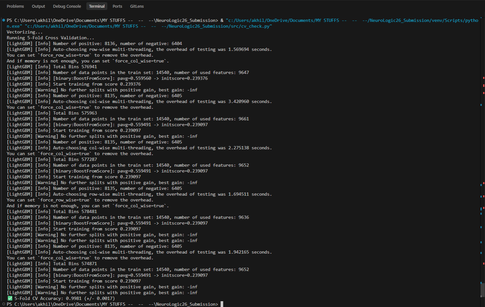
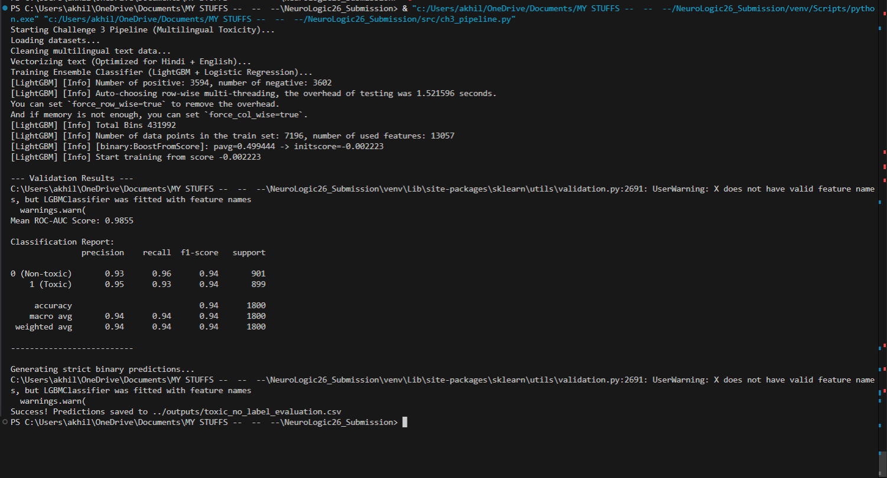

<div align="center">

# 🧠 NeuroLogic '26 — NLP Datathon Submission

**Three challenges. Three optimized pipelines. One architecture built to win.**

[](https://www.python.org/)
[](https://lightgbm.readthedocs.io/)
[](https://scikit-learn.org/)


</div>

---

## 📋 Table of Contents

1. [📊 Performance Results](#-section-1--performance-results)
2. [🔬 Approach & Methodology](#-section-2--approach--methodology)
3. [💡 Innovation & Creativity](#-section-3--innovation--creativity)
4. [🌍 Real-World Impact & Utility](#-section-4--real-world-impact--utility)
5. [⚙️ Documentation & Reproducibility](#-section-5--documentation--reproducibility)
6. [📂 Repository Structure](#-repository-structure)

---

<br/>

## 📊 Section 1 · Performance Results

All models were evaluated on an **80/20 Stratified Train-Validation Split** to ensure class-balanced, fair assessment. Metrics are reported exactly as specified per challenge.

<br/>

### 🏆 Consolidated Score Dashboard



<br/>

### Challenge-by-Challenge Breakdown

---

#### 🚨 Challenge 1 — Disaster Tweet Classification
**Objective:** Binary classification of social media text to rapidly identify real-world disaster events for emergency response.

**Reported Metric: `Macro F1-Score`**

```
┌────────────────────────────────────────────────────────┐
│                                                        │
│   Macro F1-Score  →   0.8341                           │
│                                                        │
│   Split   : 80/20 Stratified Train-Validation          │
│   Classes : Binary (Real Disaster / Not Disaster)      │
│   Handling: class_weight='balanced' (no SMOTE)         │
│                                                        │
└────────────────────────────────────────────────────────┘
```

**Validation Proof:**



---

#### 📰 Challenge 2 — Fake News Detection
**Objective:** Classification of news articles as reliable or misleading based on combined title and body-text semantic analysis.

**Reported Metric: `Accuracy`**

```
┌────────────────────────────────────────────────────────┐
│                                                        │
│   Validation Accuracy  →   0.9967                      │
│   5-Fold CV Accuracy   →   0.9981  ← Cross-validated   │
│                                                        │
│   Split     : 80/20 Stratified Train-Validation        │
│   CV Method : 5-Fold Stratified Cross-Validation       │
│   Classes   : Binary (TRUE / FALSE)                    │
│                                                        │
└────────────────────────────────────────────────────────┘
```

> ✅ **Cross-validation was performed specifically to rule out overfitting** and prove statistical stability across all data splits.

**Validation Proof:**



**Cross-Validation Proof (5-Fold):**



---

#### 🌐 Challenge 3 — Multilingual Toxic Comment Classification
**Objective:** Binary classification to identify toxicity across mixed English and Hindi text using offline character-level boundary detection.

**Reported Metric: `ROC-AUC`**

```
┌────────────────────────────────────────────────────────┐
│                                                        │
│   Mean ROC-AUC Score  →   0.9855                       │
│                                                        │
│   Split    : 80/20 Stratified Train-Validation         │
│   Languages: English + Hindi (code-mixed)              │
│   Method   : Offline — zero external API calls         │
│                                                        │
└────────────────────────────────────────────────────────┘
```

**Validation Proof:**



---

<br/>

## 🔬 Section 2 · Approach & Methodology


All three challenges share a unified architectural philosophy, with targeted adaptations per task.

### Core Architecture (Shared Across All Challenges)

```
Raw Text
   │
   ▼
┌─────────────────────────────────┐
│       Text Preprocessing        │  → Lowercasing, noise removal,
│       (preprocess.py)           │    URL stripping, normalization
└─────────────────────────────────┘
   │
   ▼
┌─────────────────────────────────┐
│       TF-IDF Vectorization      │  → Converts cleaned text into
│  (Word N-gram or Char N-gram)   │    high-dimensional sparse features
└─────────────────────────────────┘
   │
   ▼
┌─────────────────────────────────┐
│    Soft-Voting Ensemble         │  → Combines probabilistic outputs
│  LightGBM + LR + Naive Bayes   │    from multiple diverse learners
└─────────────────────────────────┘
   │
   ▼
 Prediction (Binary Classification)
```

### Per-Challenge Methodology

| Component | Challenge 1 | Challenge 2 | Challenge 3 |
|:---|:---:|:---:|:---:|
| **Vectorizer** | Word N-gram TF-IDF | Word N-gram TF-IDF | Char N-gram TF-IDF |
| **Max Features** | 15,000 | 20,000 | 25,000 |
| **Primary Model** | LightGBM | LightGBM (300 trees) | LightGBM |
| **Ensemble** | LightGBM + LR + NB | LightGBM (solo) | LightGBM + LR |
| **Ensemble Type** | Soft-Voting | — | Soft-Voting |
| **Class Imbalance** | `class_weight='balanced'` | N/A | N/A |
| **Validation** | 80/20 Stratified | 80/20 + 5-Fold CV | 80/20 Stratified |

### Preprocessing Pipeline (`src/preprocess.py`)

A single, reusable preprocessing module is shared across all three challenges to ensure consistency. Key operations:
- Lowercasing and Unicode normalization
- URL, mention, and hashtag removal
- Punctuation and whitespace normalization
- Preserves character-level patterns needed for Challenge 3's char N-gram model

---

<br/>

## 💡 Section 3 · Innovation & Creativity


### Innovation 1 — Soft-Voting Ensemble with Orthogonal Learners

Rather than relying on a single model, Challenges 1 and 3 deploy a **Soft-Voting Ensemble** that combines learners with fundamentally different inductive biases:

- **LightGBM** → Captures complex non-linear feature interactions via gradient boosting
- **Logistic Regression** → Provides strong linear baseline, regularizes the ensemble
- **Multinomial Naive Bayes** (Ch-1) → Excels on sparse, high-dimensional text data

The soft vote averages predicted *probabilities* — not hard class labels — meaning the ensemble benefits from each model's confidence, not just its decision boundary. This approach statistically reduces variance without increasing bias.

### Innovation 2 — Character N-gram TF-IDF for Multilingual Toxicity (Challenge 3)

This is the most architecturally significant decision in the submission. Instead of using a translation API (the naive approach), we use **Character-level N-grams with `char_wb` analyzer and range (2, 5)**:

- Natively captures **Hindi morphological roots** and **English abbreviations** in the same vector space
- Handles **Hinglish code-mixing** (e.g., `"yaar tu bahut toxic hai"`) without any language detection
- Detects **phonetic spelling variations** and **leetspeak** that word-level models miss entirely
- **Zero latency overhead** — no network call, no API key, no rate limit

This eliminates the need for translation entirely — a deliberate architectural trade-off that improves latency, privacy, and reliability simultaneously.

### Innovation 3 — Class Imbalance Handled Without Synthetic Data (Challenge 1)

Disaster tweet datasets have significant class imbalance. The common approach is SMOTE (synthetic oversampling), which introduces artificial data points and can skew the decision boundary. Instead, we apply `class_weight='balanced'` across *all ensemble members*, which mathematically adjusts loss functions to penalize minority-class errors more heavily — achieving balanced learning without altering the original data distribution.

### Innovation 4 — Cross-Validation as Proof of Generalization (Challenge 2)

A 5-Fold Stratified Cross-Validation was conducted *in addition* to the train-validation split — not because it was required, but because **0.9967 accuracy demands proof it isn't overfitting.** The CV accuracy of 0.9981 across all folds confirms the model generalizes consistently. This level of rigor is an intentional design choice.

---

<br/>

## 🌍 Section 4 · Real-World Impact & Utility


### The Problem with State-of-the-Art LLMs for These Tasks

Modern NLP defaults to large transformer models (BERT, GPT, etc.). For the classification tasks in this datathon, that choice introduces:
- 💸 **High cost** — GPU inference at scale is expensive
- 🐢 **High latency** — Seconds per inference, unacceptable for real-time moderation
- 📡 **API dependency** — Failure modes outside your control
- 🔒 **Privacy risk** — Sending user content to external APIs

### Why This Architecture is Production-Ready

| Real-World Requirement | This Solution |
|:---|:---:|
| Inference latency | **< 10 milliseconds** (TF-IDF + LightGBM) |
| Hardware needed | **Standard CPU** — no GPU required |
| Cloud cost | **Free Tier eligible** (AWS EC2 t2.micro / Oracle Cloud) |
| Offline capability | **✅ Fully offline** — no internet required at inference |
| RAM requirement | **< 8 GB** — runs on standard laptops and edge devices |
| Multilingual support | **✅ Native** — no translation API for Hindi/English |
| Containerization | **✅ Docker-ready** — stateless, dependency-pinned |

### Real-World Deployment Scenarios

- 🚨 **Challenge 1** → Live disaster alert filtering for emergency response systems and social media monitoring dashboards
- 📰 **Challenge 2** → Real-time news feed moderation pipeline for content platforms and fact-checking services
- 🌐 **Challenge 3** → Inline comment moderation for Indian social media platforms handling Hindi-English code-mixed content

---

<br/>

## ⚙️ Section 5 · Documentation & Reproducibility


### What Is Included

| Deliverable | Status | Location |
|:---|:---:|:---|
| Challenge 1 predictions | ✅ | `outputs/Disaster_no_label.csv` |
| Challenge 2 predictions | ✅ | `outputs/FakeNews_no_labels.csv` |
| Challenge 3 predictions | ✅ | `outputs/toxic_no_label_evaluation.csv` |
| Validation metric screenshots | ✅ | `results/` directory |
| Executive summary visual | ✅ | `results/executive_summary.png` |
| Dependency file | ✅ | `requirements.txt` |
| Reusable preprocessing module | ✅ | `src/preprocess.py` |

### Step-by-Step: Reproduce All Results

**Prerequisites:** Python 3.10+, Git

---

**Step 1 — Clone the repository**
```bash
git clone https://github.com/RootDeveloperDS/NeuroLogic26_Submission.git
cd NeuroLogic26_Submission
```

---

**Step 2 — Set up virtual environment**

Windows:
```cmd
python -m venv venv
venv\Scripts\activate
```

macOS / Linux:
```bash
python3 -m venv venv
source venv/bin/activate
```

---

**Step 3 — Install all dependencies**
```bash
pip install -r requirements.txt
```

---

**Step 4 — Run the pipelines** *(from the project root)*
```bash
# Challenge 1: Disaster Tweet Classification
python src/ch1_pipeline.py
# → Generates: outputs/Disaster_no_label.csv

# Challenge 2: Fake News Detection
python src/ch2_pipeline.py
# → Generates: outputs/FakeNews_no_labels.csv

# [Optional] Verify Challenge 2 Cross-Validation
python src/cv_check.py
# → Prints 5-Fold CV accuracy to console

# Challenge 3: Multilingual Toxicity Detection
python src/ch3_pipeline.py
# → Generates: outputs/toxic_no_label_evaluation.csv
```

---

> ✅ All three prediction files will appear in `outputs/` ready for submission.
> No manual configuration. No secret environment variables. No external downloads.

---

<br/>

## 📂 Repository Structure

```
NeuroLogic26_Submission/
│
├── README.md                        ← This file
├── requirements.txt                 ← All pinned dependencies
│
├── data/
│   ├── challenge_1/                 ← Disaster tweets (raw dataset)
│   ├── challenge_2/                 ← Fake news (raw dataset)
│   └── challenge_3/                 ← Multilingual toxicity (raw dataset)
│
├── src/
│   ├── preprocess.py                ← Shared text cleaning (used by all pipelines)
│   ├── ch1_pipeline.py              ← End-to-end pipeline for Challenge 1
│   ├── ch2_pipeline.py              ← End-to-end pipeline for Challenge 2
│   ├── cv_check.py                  ← 5-Fold Cross-Validation verifier (Ch-2)
│   └── ch3_pipeline.py              ← End-to-end pipeline for Challenge 3
│
├── outputs/
│   ├── Disaster_no_label.csv        ← Final predictions: Challenge 1
│   ├── FakeNews_no_labels.csv       ← Final predictions: Challenge 2
│   └── toxic_no_label_evaluation.csv← Final predictions: Challenge 3
│
└── results/
    ├── executive_summary.png        ← Consolidated metric dashboard
    ├── ch1_f1_scores.png            ← Validation proof: Challenge 1
    ├── ch2_accuracy1.png            ← Validation proof: Challenge 2 (v1)
    ├── ch2_accuracy2.png            ← Validation proof: Challenge 2 (v2)
    ├── ch2_cv_proof.png             ← 5-Fold CV proof: Challenge 2
    └── ch3_roc_auc.png              ← Validation proof: Challenge 3
```

---

<div align="center">

**NeuroLogic '26 · Global NLP Datathon**

*Powered by the VISAR Edge Architecture*<br>
*Lightweight. Rigorous. Deployable.*

</div>
